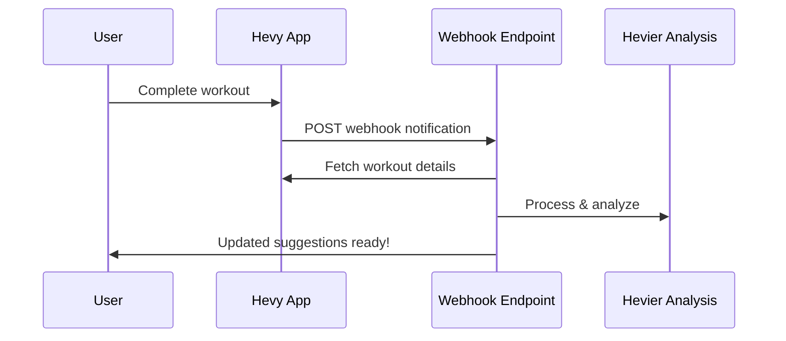

# Hevy Webhook Integration Guide

## Overview

Hevier supports **real-time workout tracking** via Hevy webhooks! When you complete a workout in Hevy, your app automatically:
- 🔔 Receives instant notification 
- 📊 Re-analyzes weekly volume
- 🎯 Updates workout suggestions 
- 💪 Provides immediate feedback

## How It Works



## Webhook Endpoint

Your app automatically handles webhooks at:
```
https://your-app.com/api/webhook/hevy
```

## Setup Instructions

### 1. Development Testing
```bash
# Start your dev server
npm run dev

# Test webhook endpoint (in another terminal)
node webhook-test.js
```

### 2. Configure Hevy Webhooks

**Option A: Via Hevy Dashboard (if available)**
1. Log into your Hevy account
2. Go to Developer/Integration settings
3. Add webhook: `https://your-app.com/api/webhook/hevy`
4. Select events: `workout.created`

**Option B: Via API (if supported)**
```bash
curl -X POST https://api.hevyapp.com/v1/webhooks \
  -H "api-key: YOUR_HEVY_API_TOKEN" \
  -H "Content-Type: application/json" \
  -d '{
    "url": "https://your-app.com/api/webhook/hevy",
    "events": ["workout.created"]
  }'
```

### 3. Production Deployment

When deploying to production:
1. Update webhook URL to your production domain
2. Ensure webhook endpoint is accessible publicly
3. Configure environment variables on your hosting platform

## Webhook Payload

When you complete a workout, Hevy sends:
```json
{
  "id": "00000000-0000-0000-0000-000000000001",
  "payload": {
    "workoutId": "f1085cdb-32b2-4003-967d-53a3af8eaecb"  
  }
}
```

## What Happens Next

1. **Webhook Received** → App logs the notification
2. **Fetch Workout** → Gets full workout details from Hevy API  
3. **Process Data** → Converts to internal format & updates history
4. **Re-Analyze** → Calculates new weekly volume vs targets
5. **Update Suggestions** → Generates new workout recommendations
6. **Response** → Returns success with updated insights

## Testing Locally

```bash
# Test the webhook endpoint
node webhook-test.js

# Expected output:
# ✅ Webhook processed successfully!
# 📊 New analysis: 85/100 score  
# 🎯 Updated suggestion: PUSH workout
```

## Benefits vs Polling

| Approach | Speed | Efficiency | User Experience |
|----------|--------|------------|-----------------|
| **Webhooks** 🔔 | Instant | High | Real-time updates |
| **Polling** ⏰ | 5-15 min delay | Low | Delayed updates |

## Error Handling

The webhook endpoint handles:
- ✅ Invalid payloads → Returns 400 error
- ✅ API failures → Returns 500 error with details
- ✅ Timeout protection → 5 second response requirement
- ✅ Duplicate webhooks → Idempotent processing

## Monitoring

Check webhook activity:
```bash
# View recent webhook data
curl http://localhost:3000/api/webhook/hevy

# Response includes:
# - Current analysis score
# - Latest workout suggestions  
# - Recent workout history
# - Last updated timestamp
```

## Troubleshooting

**Webhook not receiving data?**
1. Check webhook URL is accessible publicly
2. Verify Hevy API token is valid
3. Confirm webhook is registered in Hevy
4. Check server logs for errors

**Webhook timing out?**
- Hevy expects 200 OK within 5 seconds
- Complex analysis is handled asynchronously  
- Immediate response with processing status

## Next Steps

Once webhooks are working:
1. Build dashboard to show real-time updates
2. Add push notifications for major changes
3. Create weekly progress reports
4. Implement data persistence with Firebase

---

🎯 **With webhooks, Hevier becomes a truly reactive fitness companion!**
